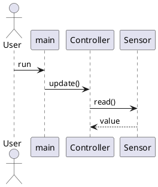
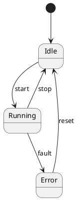

# OOP and UML Basics

This file is a centralized beginner reference for reading OOP-style C code, UML, and PlantUML.

Each important concept is grouped in one place with the same structure:

- meaning
- when to use it
- UML notation
- PlantUML syntax
- C-style example

## 1. How to Read This File

If you are reading a diagram and get stuck:

1. Find the concept name here, like `Composition` or `Association`.
2. Read its meaning.
3. Check the UML notation.
4. Check the PlantUML syntax.
5. Compare it with the C example.

## 2. OOP in C

This project is written in C, but many chapters use object-oriented ideas.

A common mapping is:

- `struct` -> class/object data
- function like `Type_doWork()` -> method/operation
- pointer to another `struct` -> relationship
- `Init()` / `Cleanup()` -> lifecycle

Example:

```c
typedef struct Sensor Sensor;
struct Sensor {
    int channel;
};

void Sensor_Init(Sensor* const me);
int Sensor_read(Sensor* const me);
```

UML idea:

```text
Sensor
- channel : int
+Init()
+read() : int
```

## 3. UML Class Box

A UML class box usually has 3 parts:

```text
+-----------------------------+
| ClassName                   |
+-----------------------------+
| field1 : int                |
| field2 : Sensor*            |
+-----------------------------+
| method1()                   |
| method2(value : int) : bool |
+-----------------------------+
```

Meaning:

- top: class name
- middle: fields/attributes
- bottom: methods/operations

Visibility symbols:

- `+` public
- `-` private
- `#` protected
- `~` package/internal

In C, these are usually conceptual because the language does not enforce classes the same way C++ or Java do.

## 4. Core OOP Terms

### Class

Meaning:
- A blueprint that describes data and behavior.

When to use it:
- When you want to describe a type of thing in the system.

UML notation:

```text
class MotorController
```

PlantUML syntax:

```plantuml
class MotorController
```

C-style example:

```c
typedef struct MotorController MotorController;
struct MotorController {
    int speed;
};
```

### Object

Meaning:
- One real instance of a class.

When to use it:
- When you talk about an actual variable or created instance.

UML notation:
- Usually the class diagram focuses on the class, not every object instance.

PlantUML syntax:
- Objects are more commonly shown in sequence or object diagrams than class diagrams.

C-style example:

```c
MotorController leftMotor;
```

### Attribute / Field

Meaning:
- Data stored inside an object.

When to use it:
- When the object needs memory/state.

UML notation:

```text
speed : int
```

PlantUML syntax:

```plantuml
class MotorController {
  speed : int
}
```

C-style example:

```c
struct MotorController {
    int speed;
};
```

### Method / Operation

Meaning:
- Behavior the object can perform.

When to use it:
- When the object has responsibilities or actions.

UML notation:

```text
setSpeed(value : int)
```

PlantUML syntax:

```plantuml
class MotorController {
  setSpeed(value : int)
}
```

C-style example:

```c
void MotorController_setSpeed(MotorController* const me, int value);
```

### Encapsulation

Meaning:
- Group related data and behavior together.
- The object manages its own state instead of letting everything modify it freely.

When to use it:
- When you want cleaner responsibilities and safer state changes.

UML notation:
- No special arrow.
- Usually shown by keeping fields and methods in the same class box.

PlantUML syntax:

```plantuml
class Queue {
  head : int
  size : int
  insert()
  remove()
}
```

C-style example:

```c
struct Queue {
    int head;
    int size;
};

void Queue_insert(Queue* const me, int value);
```

### Abstraction

Meaning:
- Show the important behavior, hide low-level detail.

When to use it:
- When implementation detail would distract from the main idea.

UML notation:
- Often just shown by high-level method names.

PlantUML syntax:

```plantuml
class Sensor {
  read() : int
}
```

C-style example:

```c
int Sensor_read(Sensor* const me);
```

The function name hides hardware register details behind a simpler idea: `read`.

### Inheritance

Meaning:
- One class is a specialized version of another.
- This is an `is-a` relationship.

When to use it:
- When the child truly is a kind of the parent.

UML notation:

```text
Child --|> Parent
```

PlantUML syntax:

```plantuml
TemperatureSensor --|> Sensor
```

C-style example:
- Classic inheritance is not native to C.
- In C, people sometimes simulate it with embedded structs, but many C codebases avoid it.

### Polymorphism

Meaning:
- Different objects respond to the same operation in different ways.

When to use it:
- When multiple components share a common behavior but implement it differently.

UML notation:
- Often appears together with interfaces or inheritance.

PlantUML syntax:

```plantuml
class LCDDisplay
class AlarmDisplay
LCDDisplay ..|> Display
AlarmDisplay ..|> Display
```

C-style example:
- In C, this is often modeled with callbacks or function pointers.

```c
typedef void (*UpdateFunc)(void* context, int value);
```

### Interface

Meaning:
- A contract for behavior.
- It says what operations exist, not how they are implemented.

When to use it:
- When several classes should support the same operations.

UML notation:

```text
Class ..|> Interface
```

PlantUML syntax:

```plantuml
interface Display {
  update(value : int)
}

HistogramDisplay ..|> Display
```

C-style example:
- C often uses function pointers or a documented callback signature instead of formal interfaces.

## 5. Relationship Types

This section is the most important for reading arrows.

### Association

Meaning:
- One class knows about another class.
- One class can access or use the other.
- In C, this is often a pointer field.

When to use it:
- When an object stores a reference/pointer to another object.

UML notation:

```text
A --> B
```

PlantUML syntax:

```plantuml
A --> B
```

C-style example:

```c
struct ECG_Module {
    struct TMDQueue* itsTMDQueue;
};
```

UML reading:

```text
ECG_Module --> TMDQueue
```

This usually means:

- `ECG_Module` has a pointer to `TMDQueue`
- `ECG_Module` knows about `TMDQueue`
- `ECG_Module` can call queue-related functions

Important note:
- Association does not automatically mean ownership.

### Dependency

Meaning:
- One thing uses another thing temporarily.
- The relationship is weaker than storing it as a field.

When to use it:
- When a function parameter, local variable, or short-lived call uses another type.

UML notation:

```text
A ..> B
```

PlantUML syntax:

```plantuml
A ..> B
```

C-style example:

```c
void Controller_logStatus(Controller* const me, Logger* logger);
```

UML reading:

```text
Controller ..> Logger
```

Because `Controller` uses `Logger`, but may not store it.

### Aggregation

Meaning:
- Weak whole-part relationship.
- The whole refers to the part, but the part may live independently.
- Think: `has-a`, but not strong ownership.

When to use it:
- When one object groups or references parts it does not fully own.

UML notation:

```text
Whole o-- Part
```

The hollow diamond is on the `whole` side.

PlantUML syntax:

```plantuml
Whole o-- Part
```

C-style example:

```c
struct SensorManager {
    struct Sensor* sensors[4];
};
```

Possible UML reading:

```text
SensorManager o-- Sensor
```

Why:

- `SensorManager` refers to sensors
- sensors may still exist independently

### Composition

Meaning:
- Strong whole-part relationship.
- The part strongly belongs to the whole.
- The whole usually creates, contains, and manages the part lifecycle.
- Think: `owns-a`.

When to use it:
- When the part should be treated as part of the whole, not a separate shared object.

UML notation:

```text
Whole *-- Part
```

The filled diamond is on the `whole` side.

PlantUML syntax:

```plantuml
Whole *-- Part
```

C-style example:

```c
struct TestBuilder {
    struct ECG_Module itsECG_Module;
    struct TMDQueue itsTMDQueue;
};
```

Possible UML reading:

```text
TestBuilder *-- ECG_Module
TestBuilder *-- TMDQueue
```

Why:

- the fields are directly contained inside `TestBuilder`
- their lifecycle is tightly tied to `TestBuilder`

### Inheritance / Generalization

Meaning:
- Child is a specialized kind of parent.
- This is an `is-a` relationship.

When to use it:
- When the child truly can be treated as the parent conceptually.

UML notation:

```text
Child --|> Parent
```

PlantUML syntax:

```plantuml
Child --|> Parent
```

C-style example:
- Rare as direct syntax in C.
- Sometimes simulated, but not a natural C feature.

### Interface Realization

Meaning:
- A class implements the behavior promised by an interface.

When to use it:
- When several implementations share a common contract.

UML notation:

```text
Class ..|> Interface
```

PlantUML syntax:

```plantuml
Class ..|> Interface
```

C-style example:
- Usually simulated with callback signatures or function-pointer tables.

## 6. Arrow Shape Guide

This is a fast visual-memory section.

### Normal arrow

```text
-->
```

Usually means:

- association
- directed use
- knows about

### Dashed arrow

```text
..>
```

Usually means:

- dependency
- temporary use

### Hollow triangle

```text
--|>
..|>
```

Usually means:

- inheritance
- interface realization

### Hollow diamond

```text
o--
```

Usually means:

- aggregation

### Filled diamond

```text
*--
```

Usually means:

- composition

## 7. Multiplicity

Meaning:
- How many objects participate in a relationship.

Common values:

- `1` exactly one
- `0..1` zero or one
- `*` many
- `0..*` zero or many
- `1..*` one or many

UML example:

```text
Controller --> "1" Sensor
Controller --> "0..*" Display
```

PlantUML syntax:

```plantuml
Controller --> "1" Sensor
Controller --> "0..*" Display
```

## 8. Sequence Diagram Basics

Meaning:
- A sequence diagram shows runtime behavior over time.

When to use it:
- When you want to show calls, messages, and order of execution.

Main pieces:

- `actor` external user/system
- `participant` object or component
- `->` message/call
- top to bottom means time order

PlantUML syntax:



How to read it:

1. Start at the top.
2. Follow arrows downward.
3. Each arrow is a call or message.

## 9. State Diagram Basics

Meaning:
- A state diagram shows how an object or system changes state.

When to use it:
- When behavior depends on states and events.

Common words:

- state
- event
- transition
- initial state
- final state

PlantUML syntax:



## 10. Common Design Pattern Words

### Observer

Meaning:
- One subject notifies many observers when something changes.

Words to watch for:

- subscribe
- notify
- callback
- observer
- subject

### Adapter

Meaning:
- Converts one interface into another expected interface.

Words to watch for:

- wrapper
- adapter
- convert interface

### State

Meaning:
- Behavior changes depending on current state.

Words to watch for:

- state
- transition
- event

### Strategy

Meaning:
- Swap algorithms behind a common interface.

Words to watch for:

- interchangeable behavior
- policy
- algorithm family

### Proxy

Meaning:
- A stand-in object controls access to another object.

Words to watch for:

- proxy
- access control
- hardware wrapper

### Mediator / Intermediary

Meaning:
- One object coordinates communication among others.

Words to watch for:

- coordinator
- central communication point

## 11. Quick C-to-UML Mapping Table

| C code pattern | UML idea |
|---|---|
| `struct A { int x; };` | class with field |
| `struct A { struct B* itsB; };` | `A --> B` association |
| `struct A { struct B itsB; };` | `A *-- B` composition |
| `void A_do(A* const me);` | method/operation |
| callback function pointer | interface/polymorphism-like behavior |
| `Init()` / `Cleanup()` | object lifecycle |

## 12. Quick Cheat Sheet

```text
+ field/method     public
- field/method     private
# field/method     protected
~ field/method     package/internal

-->                association / knows about / often pointer field
..>                dependency / temporary use
o--                aggregation / weak has-a
*--                composition / strong owns-a
--|>               inheritance / is-a
..|>               interface realization / implements

"1"                exactly one
"0..1"             zero or one
"0..*"             zero or many
"1..*"             one or many
```

## 13. Beginner Reading Order

When reading a new UML diagram:

1. Read the class names first.
2. Read the fields.
3. Read the methods.
4. Read arrows between classes.
5. Check whether the relationship is association, aggregation, or composition.
6. If you see a triangle, think inheritance or interface.
7. If you see a sequence diagram, read top to bottom.

## 14. Best Mental Shortcut

If everything feels abstract, use this:

- box = thing
- field = data inside thing
- method = action thing can do
- arrow = who uses or knows whom
- hollow diamond = weak has-a
- filled diamond = strong owns-a
- triangle = is-a / implements
- sequence arrow = runtime call

If you want, I can next add a root-level [uml-legend.puml](/home/thinhdo/learn/design-patterns-for-embedded-system-in-c/uml-legend.puml) that visually demonstrates every arrow type in one previewable diagram.
